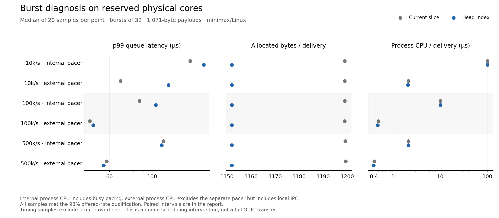

# Isolated burst diagnosis: the large speed advantage did not reproduce

## Decision

Keep the current receive slice. Head-index remains a modest efficiency candidate with an unresolved low-rate tail-latency regression. Under exclusive CPU placement and external pacing, it reduced allocated bytes per delivery by about 3.9% and measured-process CPU per delivery by 1.9–3.3%. The previous large high-rate throughput/loss advantage did not reproduce. Every externally paced timing sample delivered all messages actually offered to its queue; neither variant had queue drops. The low-rate p99 regression remained, with a paired estimate of +41.84% [11.55%, 77.34%] at 10,000 datagrams/sec.

This follow-up completed all 240 timing samples, 36 separate profile runs, 12 short receiver race smokes, and native focused normal/race tests. Every timing sample met the 98% offered-rate qualification. No timing samples were filtered, repeated, or replaced. The CPU reservation was removed and all 32 logical CPUs returned to the host. No runtime change was merged, and the completed D2/program state was not reopened.

The [protocol](2026-09-06-d2-burst-protocol.md), [full timing analysis](d2-burst/analysis.json), [profile summary](d2-burst/profile-summary.json), and [reproduction guide](d2-burst/README.md) contain the finite method and evidence. The [earlier paced report](2026-09-06-d2-paced-results.md) remains historical evidence; this report narrows its interpretation rather than replacing its samples.

## What changed in the experiment

Linux temporarily reserved physical cores 8, 9, and 10 plus SMT siblings 24, 25, and 26 using an exclusive cgroup v2 `root` partition. The queue process used CPUs 8/9; the external pacer used 10. The partition retained normal load balancing inside its CPU set and excluded other user processes and VMs from that set. This is the exclusivity defined by the kernel's [cpuset partition documentation](https://docs.kernel.org/admin-guide/cgroup-v2.html#cpuset). It does not eliminate shared-cache, power, interrupt, or all kernel effects.

The [initial receipt](d2-burst/isolation-before.json) shows parent effective CPUs `0-7,11-23,27-31` and exclusive partition CPUs `8-10,24-26`. Every sample rechecked the valid partition before and after execution. The all-core monitor recorded zero guest activity and zero sampled IRQ/softirq percentages on all six reserved logical CPUs; sibling mean idle percentages were 99.953%, 99.945%, and 99.977%. The [restoration receipt](d2-burst/isolation-after.json) shows `0-31`, and the temporary cgroup's absence was verified. Idle cores were available, as the user pointed out; the earlier problem was test placement, not machine capacity.

The old busy pacer ran as a control on the same reserved cores. In the external mode, a separate process sent one nonblocking Unix datagram tick for each burst of 32; the measured producer blocked between ticks. Payloads, owning copies, the queue, and receiver checks stayed in the measured process. This changes producer readiness and adds IPC overhead/state, so it tests a scheduling intervention rather than perfectly subtracting pacing cost. Rates remained 10,000, 100,000, and 500,000 datagrams/sec with 1,071-byte records and no programmed receiver pauses.

## Timing and efficiency results

Values below are variant medians from 20 unprofiled samples each, shown as baseline → head-index. p99 is a 1 µs histogram bucket boundary. These descriptive medians differ from paired estimates when sample variation is asymmetric.

| Rate / pacing | Offered/sec | Queue loss (%) | p50 / p99 (µs) | Bytes/delivery |
| --- | ---: | ---: | ---: | ---: |
| 10,000 / internal | 10,000 → 10,000 | 0.0000 → 0.0000 | 93 / 158 → 93 / 185.5 | 1198.93 → 1152.01 |
| 10,000 / external | 10,000 → 10,000 | 0.0000 → 0.0000 | 8 / 68.5 → 7 / 121.5 | 1198.94 → 1152.01 |
| 100,000 / internal | 100,000 → 100,000 | 0.0000 → 0.0160 | 56 / 86 → 56 / 104.5 | 1199.00 → 1152.00 |
| 100,000 / external | 100,000 → 100,000 | 0.0000 → 0.0000 | 3 / 47.5 → 3 / 49.5 | 1199.00 → 1152.01 |
| 500,000 / internal | 500,000 → 500,000 | 0.3196 → 0.2341 | 55 / 114.5 → 55 / 112 | 1199.26 → 1152.01 |
| 500,000 / external | 499,967 → 499,967 | 0.0000 → 0.0000 | 3 / 58 → 3 / 56 | 1199.39 → 1152.00 |

Every externally paced timing sample had zero queue drops. Missed generation, failed IPC writes, and expired late ticks are counted separately; no catch-up burst was emitted. At 500,000/sec the median missed-offer fraction was 0.0064% in both external variants, mostly expiry of late ticks; the worst external sample missed 0.1824% of planned offers. All samples still achieved at least 98% of target. Complete missed-offer and exact rate data remain in the analysis and [original manifest](d2-burst/samples.jsonl.gz); zero queue loss is not a claim that every nominal schedule slot was emitted.

Paired head-index changes, with bootstrap 95% intervals:

| Rate / pacing | Bytes/delivery change (%) | Process CPU/delivery change (%) | p99 change (%) |
| --- | ---: | ---: | ---: |
| 10,000 / internal | -3.91 [-3.91, -3.91] | +0.02 [+0.00, +0.04] | +15.13 [+2.26, +29.48] |
| 10,000 / external | -3.92 [-3.92, -3.91] | -1.86 [-3.24, -0.47] | +41.84 [+11.55, +77.34] |
| 100,000 / internal | -3.92 [-3.93, -3.92] | +0.02 [-0.04, +0.07] | +8.96 [-0.89, +19.84] |
| 100,000 / external | -3.92 [-3.92, -3.92] | -3.26 [-4.58, -2.04] | +5.05 [-10.40, +24.03] |
| 500,000 / internal | -3.94 [-3.95, -3.94] | +0.50 [+0.14, +0.90] | -1.96 [-3.53, -0.38] |
| 500,000 / external | -3.95 [-3.95, -3.95] | -3.00 [-3.82, -2.24] | -3.69 [-4.44, -3.02] |

With external pacing, median CPU per delivery was 2.132 → 2.099 µs at 10k/sec, 0.492 → 0.478 µs at 100k/sec, and 0.407 → 0.395 µs at 500k/sec. These are modest process-efficiency gains, including IPC and measurement work, not full QUIC CPU or file-transfer improvements. The much larger internal-to-external CPU reduction mostly removes the busy pacer from the measured process; that CPU still runs on core 10.

At the highest rate, externally paced p99 improved only 3.69% [3.02%, 4.44% better], with essentially equal successful throughput. Even the isolated internal-pacer control showed only a 1.96% p99 improvement and no consistent throughput advantage. Thus the earlier approximately 67% tail improvement and 4% throughput advantage were not robust across this controlled follow-up. The historical run and this run differ in time, placement, isolation, and small harness plumbing, so the evidence does not uniquely assign the old result to VM interference.

At 10k/sec, the external candidate's typical latency improved (median p50 8 → 7 µs), while its tail worsened (median p99 68.5 → 121.5 µs; paired estimate +41.84%). This is a real remaining regression signal within the measured workload. Lower allocation or average CPU does not guarantee a better p99.

## What the profiles explain

The scheduling intervention had a large effect on both variants. At 100k/sec, median p50 fell from 56 µs with internal pacing to 3 µs with external pacing; at 500k/sec it fell from 55 to 3 µs. The trace-derived accumulated runnable-to-running delay fell from about 359 to 37 ms for the 100k baseline and from 1,712 to 169 ms for the 500k baseline. Candidate totals changed similarly. These are aggregate goroutine delays in separate two-second traces, not packet p99 or CPU time.

| Rate | Internal scheduler delay (ms), base → head | External scheduler delay (ms), base → head |
| --- | ---: | ---: |
| 10,000/sec | 60.82 → 49.36 | 14.71 → 14.62 |
| 100,000/sec | 359.47 → 362.85 | 36.81 → 38.64 |
| 500,000/sec | 1711.52 → 1690.90 | 168.76 → 161.53 |

In the high-rate internal baseline, 1,651 ms of the scheduler profile was attributed to `runtime.selectnbsend`, the queue notification's wakeup site; with external pacing that attribution fell to 138 ms. The [internal](d2-burst/profiles/500000-internal-base.sched.top.log) and [external](d2-burst/profiles/500000-external-base.sched.top.log) summaries support a substantial pacing/scheduler interaction. The profile labels refer to the stack making a goroutine runnable; they do not mean the channel-send instruction itself consumed that much CPU. The [low-rate internal CPU profile](d2-burst/profiles/10000-internal-base.cpu.top.log) also spent 93.8% of sampled CPU in `time.runtimeNow`, confirming that the busy clock loop dominated that process.

The allocation saving survived every mode/rate comparison: baseline roughly 1,199 bytes/delivery versus head-index 1,152. External medium/high median GC counts fell from 89 → 85 and 432.5 → 415.5 per two-second sample, consistent with reduced churn. Direct allocation and process-CPU counters are stronger evidence for this modest benefit than the short CPU profiles. The low-rate external CPU profiles contained only five and six samples, insufficient for detailed attribution; even high-rate CPU profiles had only 73 and 70 samples.

The remaining low-rate tail regression is not explained by a demonstrated mutex or compaction hotspot. In the separate low-rate external wait profiles, total mutex delay was 0.473 ms for baseline versus 0.065 ms for head-index, despite that diagnostic run also showing a worse candidate p99. The short trace profiles had similar accumulated scheduler delay (14.71 versus 14.62 ms) and changed the tail distribution relative to unprofiled timing. Aggregate waits do not identify which individual burst caused p99. The evidence weakens a simple explanation based on more total mutex contention, but does not rule out rare lock, GC-phase, or scheduling interactions. No causal runtime fix is established.

## Hypothesis disposition and boundary

| Hypothesis | Disposition |
| --- | --- |
| In-process pacing materially changes receiver scheduling | Supported as a major harness effect: much lower ordinary latency and runnable delay after the intervention, in both variants. It does not explain away the surviving low-rate candidate regression. |
| Reduced allocation churn produces a useful efficiency gain | Supported at about 3.9% fewer bytes and 1.9–3.3% less external-mode process CPU per delivery; it did not establish a large throughput gain. |
| Lock/compaction overhead explains the candidate's low-rate tail | Not established. No corresponding increase in aggregate mutex delay was observed; sparse CPU samples and changed trace tails cannot identify the rare-event cause. |

The broad high-rate speed/loss benefit did not survive this investigation, and low-rate p99 still regressed. That does not justify promoting head-index or spending an application integration run to certify it as a general improvement. If pursued further, the remaining question is narrow: correlate individual slow low-rate bursts with GC phases, receiver wakeups, and lock holds while controlling observation overhead. This report does not claim that follow-up was performed. Production stays on the current queue representation.

Frozen baseline is `5b2a33f146eaa268f0e10e59a6dd25c1a76a765d`; candidate is `992efe2c371d9634baf39fcb371acc3eded2a5c7`. Git and exported-tree comparison found only `datagram_queue.go` different between measured variants. Normal and race binaries were built natively with Go 1.26.0 on minimax; focused tests passed on each, and all 12 receiver race smokes passed. CPU, block/mutex, and trace passes were separate from timing. Raw profile files, compressed original traces, profile commands, source/binary hashes, and host receipts are retained in [the evidence directory](d2-burst/README.md). No profiler installation, production edit, functional bug fix, full-repository certification, RAS review, or merge is claimed.
