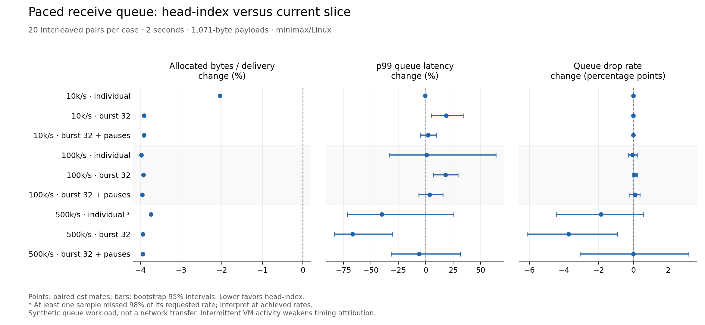

# Head-index receive queue under paced arrivals: results

## Decision

Keep head-index experimental. Allocated bytes per delivered datagram fell consistently by 2.04–3.98% across all nine paced cases, but timing was workload-dependent: the paired p99 latency estimate worsened by about 18% in both lower-rate burst cases and improved by about 67% in the highest-rate burst case. Intermittent guest/VM activity on the selected cores and their SMT siblings weakens attribution of these timing differences. This is evidence of an allocation-churn benefit and an unresolved latency tradeoff, not a general speedup or an adoption certificate.

All 360 planned samples completed; all FIFO, payload-integrity, and delivery-accounting checks passed. No sample was removed, repeated, or replaced. One baseline sample missed the predeclared 98% offered-rate qualification: round 16 of the 500,000/sec individual-arrival case achieved 97.762% of target. That case establishes behavior at its achieved rates only. All other samples met the rate qualification. These are provisional synthetic bulk-transfer scenarios, not a measured application trace or a full QUIC network test.

The [fixed protocol](2026-09-06-d2-paced-protocol.md), [reproduction instructions](d2-paced/README.md), [saved analysis](d2-paced/analysis.json), and [original sample manifest](d2-paced/samples.jsonl.gz) own the details. This investigation follows [PR #13](https://github.com/the-sarge/quic-go-fast/pull/13); completed D2 and the program frontier remain unchanged. The evidence branch contains no runtime change.

## What the rates represent

One producer feeds one receive queue with 1,071-byte records at 10,000, 100,000, or 500,000 datagrams/sec, equivalent to 85.68 Mbps, 856.8 Mbps, or 4.284 Gbps of application payload before transport/link overhead. Each rate has individual arrivals, bursts of 32, and bursts of 32 with a requested 1 ms receiver pause every 10 ms. The receiver otherwise performs payload/FIFO validation and latency accounting. Actual pauses averaged about 1.09–1.20 ms at the variant-median level; they were not exact 1 ms intervals.

The producer uses an absolute monotonic schedule and skips overdue slots instead of emitting catch-up traffic. Generator misses and queue drops are separate quantities. Queue latency runs from the enqueue attempt through Receive returning and includes allocation, mutex wait, wakeup/scheduling, and common measurement work. The producer busy-waits to avoid timer-induced millisecond batching, so process CPU includes an artificial pacer. Neither this CPU figure nor rate-limited throughput isolates queue CPU cost or maximum transfer capacity.

## Observed delivery and latency

The following values are medians across 20 samples per variant. Each cell is baseline → head-index. Quantiles are 1 µs bucket upper boundaries; no latency histogram overflow occurred. Independent variant medians are descriptive and need not equal the paired estimates below. A star marks the case with the single unqualified offered-rate sample.

| Offers/sec and shape | Achieved offers/sec | Generator misses (%) | Queue drops (%) | p50 / p99 latency (µs) |
| --- | ---: | ---: | ---: | ---: |
| 10,000, individual | 10,000 → 10,000 | 0.000 → 0.000 | 0.000 → 0.000 | 57 / 58.5 → 57 / 58 |
| 10,000, burst 32 | 10,000 → 10,000 | 0.000 → 0.000 | 0.000 → 0.000 | 95 / 128.5 → 96 / 177 |
| 10,000, burst 32 + pause | 10,000 → 10,000 | 0.000 → 0.000 | 0.000 → 0.000 | 101 / 1190 → 100.5 / 1191 |
| 100,000, individual | 99,853 → 99,883 | 0.146 → 0.116 | 0.133 → 0.113 | 28 / 58 → 27.5 / 57.5 |
| 100,000, burst 32 | 100,000 → 100,000 | 0.000 → 0.000 | 0.016 → 0.096 | 57 / 88.5 → 57 / 104.5 |
| 100,000, burst 32 + pause | 100,000 → 100,000 | 0.000 → 0.000 | 1.323 → 1.359 | 58 / 1317.5 → 58 / 1353.5 |
| 500,000, individual * | 493,405 → 494,073 | 1.319 → 1.185 | 5.112 → 4.953 | 29.5 / 145.5 → 29 / 136 |
| 500,000, burst 32 | 499,408 → 499,976 | 0.118 → 0.005 | 10.305 → 5.084 | 55 / 311.5 → 55 / 121.5 |
| 500,000, burst 32 + pause | 499,942 → 499,904 | 0.011 → 0.019 | 16.298 → 14.956 | 56 / 1197 → 56 / 1182.5 |

All 10,000/sec samples delivered every offered datagram, including the pause case. At 100,000/sec, pause-case median loss was 1.32% → 1.36%; the paired loss difference remained uncertain. At 500,000/sec, loss was substantial even without the programmed pause. Burst-case medians were 10.30% → 5.08%, rising to 16.30% → 14.96% with pauses; the pause case's paired mean difference was approximately zero with a wide interval, despite those different medians. Do not turn the median difference into a claimed consistent improvement.

At 500,000/sec the unchanged 128-entry queue holds only 0.256 ms of arrivals. A 1 ms pause can therefore overwhelm either representation. That capacity calculation predicts vulnerability, not the exact measured loss: burst alignment, preexisting occupancy, oversleep, GC, scheduler behavior, and competing host activity also matter. Head-index changes storage reuse, not the admission limit or the consumer's ability to pause safely.

## Paired comparisons

The historical protocol requested paired geometric-mean intervals for positive metrics. The saved analyzer includes achieved offered-rate medians, minimum target fractions, qualification failures and paired generator-miss percentage-point differences, but omits the paired geometric-mean offered-rate interval in all nine cases. That is a reporting limitation; the archived analysis is not a complete implementation of that protocol request. Closeout preserves the original analysis and makes no paired offered-rate equivalence claim.

Each row uses all 20 matched rounds. Byte and latency changes are paired geometric-mean candidate/base ratios expressed as percentages; queue-loss differences are mean percentage-point changes. Brackets contain seeded 10,000-resample bootstrap 95% intervals. These are exploratory host/window estimates, with no multiplicity-adjusted or production-equivalence claim.

| Offers/sec and shape | Allocated bytes/delivery change (%) | p99 latency change (%) | Queue-drop change (points) |
| --- | ---: | ---: | ---: |
| 10,000, individual | -2.04 [-2.04, -2.04] | -0.49 [-1.14, +0.13] | +0.00 [+0.00, +0.00] |
| 10,000, burst 32 | -3.91 [-3.92, -3.91] | +18.60 [+4.92, +34.14] | +0.00 [+0.00, +0.00] |
| 10,000, burst 32 + pause | -3.92 [-3.93, -3.91] | +2.18 [-4.80, +9.62] | +0.00 [+0.00, +0.00] |
| 100,000, individual | -3.98 [-3.98, -3.98] | +0.74 [-33.00, +64.00] | -0.06 [-0.30, +0.22] |
| 100,000, burst 32 | -3.93 [-3.94, -3.92] | +18.12 [+6.86, +29.49] | +0.08 [-0.07, +0.23] |
| 100,000, burst 32 + pause | -3.96 [-3.96, -3.96] | +3.70 [-6.36, +15.58] | +0.09 [-0.20, +0.38] |
| 500,000, individual * | -3.74 [-3.74, -3.74] | -40.09 [-71.53, +25.52] | -1.87 [-4.44, +0.59] |
| 500,000, burst 32 | -3.94 [-3.95, -3.94] | -66.73 [-83.49, -30.23] | -3.73 [-6.13, -0.93] |
| 500,000, burst 32 + pause | -3.94 [-3.94, -3.94] | -5.90 [-31.69, +31.61] | -0.01 [-3.08, +3.19] |

The 10,000/sec and 100,000/sec burst cases have p99 estimates of +18.60% [4.92%, 34.14%] and +18.12% [6.86%, 29.49%]. Preserve these as observed regression signals; the allocation benefit does not erase them. Conversely, the 500,000/sec burst case has a p99 estimate of −66.73% [−83.49%, −30.23%] and queue loss lower by 3.734 percentage points [0.929, 6.128 points lower]. Preserve that promising result too, without treating it as proof of a workload-independent advantage. Shared-host activity and the small instrumented process prevent assigning either result exclusively to queue storage.

## Allocation and GC interpretation

Head-index used approximately 1,152 bytes and one allocation per delivered datagram in every case. Baseline used approximately 1,176–1,200 bytes, depending on traffic shape. Thus the durable finding is roughly 24–48 bytes of receive-slice metadata allocation avoided per delivery; the payload copy/allocation remains. At 10,000/sec individual arrivals, allocation count fell from about 1.997 to 1.000 per delivery, nearly halving allocation calls while reducing allocated bytes by only about 2%. This explains why fewer allocations need not imply a similarly large throughput improvement.

| Offers/sec and shape | Bytes/delivery | Allocations/delivery | GC cycles / 2 s sample |
| --- | ---: | ---: | ---: |
| 10,000, individual | 1176.01 → 1152.01 | 1.9966 → 1.0002 | 8 → 8 |
| 10,000, burst 32 | 1198.93 → 1152.01 | 1.0625 → 1.0001 | 8 → 8 |
| 10,000, burst 32 + pause | 1198.96 → 1152.03 | 1.0628 → 1.0004 | 8 → 8 |
| 100,000, individual | 1199.80 → 1152.03 | 1.3465 → 1.0001 | 90 → 85 |
| 100,000, burst 32 | 1199.00 → 1152.00 | 1.0625 → 1.0000 | 88 → 85 |
| 100,000, burst 32 + pause | 1199.46 → 1152.01 | 1.0464 → 1.0001 | 89 → 83 |
| 500,000, individual * | 1196.80 → 1152.01 | 1.0634 → 1.0000 | 412 → 388 |
| 500,000, burst 32 | 1199.31 → 1152.01 | 1.0515 → 1.0000 | 385 → 390 |
| 500,000, burst 32 + pause | 1199.28 → 1152.01 | 1.0503 → 1.0000 | 359 → 348.5 |

GC counts generally fell at medium/high rates, but total cycles and pause time also depend on how many messages were delivered. For example, in the high-rate burst case the candidate delivered more and had a slightly higher median GC count despite lower bytes per delivery. The complete analysis retains GC pause and pacing-inclusive CPU figures; they are not independently established transport improvements. The experiment starts after a warmed queue and forced GC, in a small isolated process. It measures allocation churn, not idle retention, startup cost, application heap behavior, or aggregate cost across many connections.

## Host quality and validation

Collection ran on minimax from 2026-09-06 18:34:35 UTC through approximately 18:46:37 UTC, using native Go 1.26.0 on Linux 7.0.0-30-generic, AMD Ryzen AI MAX+ 395, `GOMAXPROCS=2`, and affinity to CPUs 12 and 13 (different physical cores). The powersave governor and boost setting were unchanged. Median boundary frequency on CPU 12 was about 5.027 GHz for both variants; these are boundary readings, not continuous in-sample frequency measurements.

The three-second [precheck](d2-paced/precheck.log) showed all four selected/sibling CPUs idle. During collection, however, [mpstat](d2-paced/cpu-activity.log) recorded guest activity on CPUs 12/13 up to 10.20%/5.15% and on siblings 28/29 up to 70.30%/14.14% in one-second intervals. Sibling mean idle percentages were 98.35% and 99.54%, concealing short but material interference. Approximate sample/guest-interval overlaps are preserved in the analysis for every case and variant; they were not used to filter or recompute results. Matching median frequency and mostly idle siblings do not make this an exclusive-host experiment. Interleaving helps with drift but does not remove shared-resource confounding, and the bootstrap intervals do not account for that systematic uncertainty.

Frozen baseline source is `37914bf7e884ff5f777d9ef9f3df32ed1e68fa7a`; candidate source is `5d3fdb0170dc58ab6bfa871e32cc9eb925fcf4aa`. Git and extracted-tree comparisons confirm that only `datagram_queue.go` differs. The [candidate patch](d2-paced/candidate.patch) retains the existing mutex, 128-entry drop-new rule, payload ownership, FIFO, notifications, and close/cancellation behavior. The [source hashes](d2-paced/source-hashes.log), [binary hashes](d2-paced/binary-hashes.log), [toolchain](d2-paced/toolchain.log), [environment](d2-paced/go-env.log), and [validation log](d2-paced/validation.log) preserve provenance.

Both native variants passed the focused `TestDatagram` tests and the same focused tests under the race detector. Both also passed a 160 ms instrumented race smoke with 100,000/sec bursts and pauses. Timed collection used precompiled binaries without the race detector. Analysis checked the full 360-sample matrix, alternating/rotated order, successful exits, fixed durations, histogram counts, `delivered + queue drops = offered`, and `offered + generator skips = planned`. The plot was rendered and visually inspected. No full repository certification, RAS review, hosted CI success, or runtime merge is claimed.

## Next useful decision

Retain head-index as an allocation-saving candidate, with the low/medium-rate burst latency signals unresolved. Further timing work should first reserve uncontended physical cores and their SMT siblings, then use a measured application arrival/receiver trace or the actual QUIC receive path with representative downstream work and heap size. In that setup, separate pacing from the measured queue process or explicitly validate its scheduling impact, and profile wakeup/lock/GC behavior in the burst cases. That would answer a causal question; another repetition of the old unpaced benchmark or another sample extension here would not. No further collection or promotion is implied by this recommendation.
