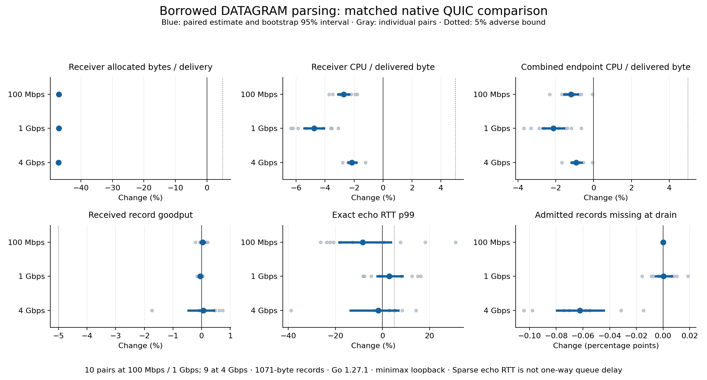

# Matched native-QUIC DATAGRAM comparison

The borrowed-parser candidate reduced receiver allocated bytes per delivered record by about 47% and receiver CPU per delivered byte by 2.1–4.8%. Combined endpoint CPU fell 0.9–2.1%. Goodput was practically unchanged. The predeclared 5% tail-latency bound was established at 100 Mbps but remains unresolved at 1 and 4 Gbps. PR 16 remains an experimental draft pending disposition, independent review and full adoption certification.

## Method and provenance

Compare public baseline `686bce6541438101c96732a023984e031faf6df7` with candidate runtime `391b3df6932fec5f14fc0396947a0c2e4fd8e2a6`. The two differing production files borrow the bounded DATAGRAM payload and document its internal lifetime; queue admission retains the owning copy. Both external measurement binaries used identical instrumentation and dependencies except those parser files, and were built natively with official Go 1.27.1, linux/amd64, CGO disabled, GOAMD64 v1, `-trimpath` and offline vendor mode. The measurement package passed against both variants before collection; candidate correctness checks are recorded in the [ownership audit](2026-09-06-datagram-ownership.md).

The workload used native QUIC over loopback on minimax (Ryzen AI Max+ 395), 1071-byte records, receiver sequence/window accounting and 100 sparse 64-byte echo probes/s. Each endpoint had GOMAXPROCS 2 and two dedicated physical cores. A temporary cgroup partition reserved those cores and their unused SMT siblings; repeated thread-mask checks verified placement before and during every completed capture. Reserved CPUs showed no guest or steal time; unused siblings averaged 99.975% idle. Other host workloads continued outside the partition, so shared cache, memory and power interference remains possible. All reserved CPUs were released afterward.

The protocol fixed 10 alternating-order pairs at each of 100 Mbps, 1 Gbps and 4 Gbps, with rotating rate order. Unprofiled captures used 2 seconds warmup, 10 seconds measurement and 1 second drain. Six separate allocation captures used 20 seconds measurement and do not supply the timing estimates. One baseline setup failed when the collector read readiness JSON during its write. The failed attempt was retained; bounded resumption ran only previously unattempted captures. There were 65 completed captures and one retained setup failure, yielding 10, 10 and nine complete unprofiled pairs respectively. The unmatched candidate is retained outside paired estimates; no replacement run, outlier removal or adaptive extension was used.

Percent changes are geometric means of within-pair candidate/base ratios, with 95% bootstrap intervals from 20,000 whole-pair resamples and seed `20260906 + rate_bps`. Delivery and generation differences use paired percentage points. The full interval must clear the 5% adverse bound to establish noninferiority; failure to detect a difference alone is insufficient. Exact echo p99 uses each run's nearest-rank successful-probe percentile and includes admission plus both endpoints, not one-way queue latency.

## Results

| Offered rate | Receiver allocation change | Receiver CPU change | Goodput change | Echo p99 change, 95% interval |
| --- | --- | --- | --- | --- |
| 100 Mbps | −46.97% | −2.71% | +0.036% | −8.46% [−18.42%, +3.49%] |
| 1 Gbps | −46.97% | −4.76% | −0.050% | +2.88% [−2.25%, +8.48%] |
| 4 Gbps | −47.10% | −2.15% | +0.055% | −1.86% [−13.65%, +6.66%] |

The [complete tables](datagram-native-comparison/results-table.md) include intervals, absolute medians and delivery/generator/probe differences. [Aggregate analysis](datagram-native-comparison/paired-results.json) retains individual pair changes and group summaries.

Receiver allocation medians fell from roughly 2464–2480 to 1304–1315 bytes per delivered record. Separate allocation profiles confirmed removal of the parser payload allocation; the frame object still allocates and the queue copy remains. At 4 Gbps, the parser's sampled share fell from 48.36% to 2.42%, while the queue accounted for 92.20% of candidate receiver allocations.

Goodput intervals clear the 5% adverse bound at every rate. The tiny 1 Gbps decrease is statistically detectable [−0.086%, −0.014%] and coincides with 0.047 percentage points more missed generator opportunities; it does not identify a queue defect. Fixed offered rates and roughly 3–5% generation misses do not establish maximum sustainable throughput or file-transfer acceleration.

The tail intervals establish neither an improvement nor a regression. At 1 and 4 Gbps they still permit regressions of 8.48% and 6.66%, so the 5% bound is unresolved. At 4 Gbps, absolute median p99 rose from 3.924 to 4.081 ms while the paired geometric estimate fell: medians across runs and means of within-pair ratios are different summaries. One pair improved 38.8%, and every pair remains in the estimate. The broad interval is the appropriate qualification.

At 4 Gbps, median admitted records missing at drain fell from 0.1610% to 0.0962%; the paired change was −0.06235 percentage points [−0.07966, −0.04458]. This supports improved application receipt in this workload without locating the loss. Missing echo replies across matched baseline/candidate captures were 0/0 of 9610/9606 attempts at 100 Mbps, 2/0 of 9704/9702 at 1 Gbps, and 89/93 of 8470/8415 at 4 Gbps. Successful-probe tails therefore remain conditional on receipt. Completed captures had no rejected, canceled, deadline-failed, duplicate, invalid or received-without-admission bulk records.

## Evidence boundary and disposition

The private external fixture archive retains all attempted captures, exact echo samples, independent ledgers, allocation profiles, binary/source identities, collector versions and placement/cleanup receipts. Validation reconciled ledgers and echo histograms, checked all 24 profile hashes/lengths and verified configuration, binary identity and placement. Its evidence archive SHA-256 is `fe63e5c43d1f1cb608669cb4f051cc9fc2e2ad1a120fb7d34690a23808cfc8a6`; baseline binary SHA-256 is `e23e996313a3b815fbd67a895ee457d1e12405362cf22d3a0d30484959e45e1d`, candidate is `71a71478f323fe716fc371bb795466be05af5e65bda6dfc2e6fe01c609d9dbcf`. This public report exposes generic aggregate evidence only; the private fixture and raw artifacts are not publicly reproducible from this repository alone.

The resource prediction passed. Higher-rate tail noninferiority remains unresolved and needs disposition before an unqualified adoption claim. This campaign does not qualify physical-link, disk, FEC or production file-completion behavior. Full repository certification, hosted checks, independent review and merge remain outstanding; completed D1/D2 gates and program tracking remain unchanged.

The subsequent [focused tail follow-up](2026-09-06-datagram-tail-followup.md) used 20 pairs per rate and 60-second windows. It establishes the 5% bound at 1 Gbps, while 4 Gbps remains inconclusive. The campaigns are analyzed separately; this report preserves the original shorter-window results.
