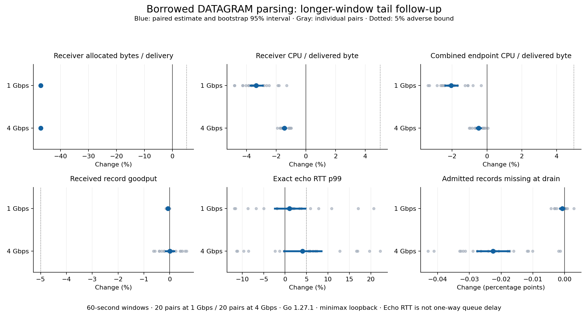

# Focused DATAGRAM tail follow-up

The longer-window comparison establishes the predeclared 5% echo-p99 noninferiority bound at 1 Gbps, but the 4 Gbps result remains inconclusive. Receiver allocation and CPU savings persist. The condition for proceeding to independent review and full adoption validation at both rates was not met; PR 16 remains an experimental draft.

## Fixed experiment

This follows the [initial matched native-QUIC comparison](2026-09-06-datagram-native-comparison.md) using the same optimized native Linux Go 1.27.1 binaries and identical instrumentation. Baseline public source is `686bce6541438101c96732a023984e031faf6df7`; candidate runtime is `391b3df6932fec5f14fc0396947a0c2e4fd8e2a6`. The only differing production files borrow the bounded DATAGRAM payload and document its internal lifetime; queue admission retains its owning copy. No executable was changed or rebuilt for this follow-up.

The plan was frozen before collection: 20 baseline/candidate pairs at each of 1 and 4 Gbps, alternating variant order and rotating rate order by round. Each capture used 2 seconds warmup, 60 seconds measurement and 1 second drain, native QUIC loopback, 1071-byte records, receiver sequence/window accounting and 100 sparse 64-byte echo probes/s. Each endpoint had two Go processors and two dedicated physical cores, with its unused SMT siblings also reserved. All 80 captures completed and qualified, without failed attempts, replacement runs, exclusions, restarts, outlier removal or adaptive extension.

Percent changes are geometric means of within-pair ratios. Bootstrap 95% intervals use 20,000 whole-pair resamples and seed `20260906 + rate_bps`, separately at each rate. The entire p99 interval must remain below +5% to establish the bound. Per-run p99 is the exact nearest-rank percentile of successful echo RTTs, including admission and both endpoints. These are not one-way queue delays or independent-packet statistical replicates.

## Results

| Offered rate | Median run p99, baseline → candidate | Paired p99 change, 95% interval | 5% bound |
| --- | --- | --- | --- |
| 1 Gbps | 0.514 → 0.525 ms | +1.02% [−2.41%, +4.71%] | Established in this campaign |
| 4 Gbps | 2.117 → 2.175 ms | +4.04% [−0.20%, +8.45%] | Not established |

The 4 Gbps interval permits both no change and a slowdown beyond the bound. It establishes neither a regression nor noninferiority. Absolute medians and paired geometric changes are different summaries and need not give the same percent change. Longer windows also use larger preallocated measurement ledgers, identically in both variants; this campaign is analyzed separately from the previous 10-second runs.

Receiver allocation per delivered record fell 47.08% at 1 Gbps and 47.12% at 4 Gbps. Receiver CPU per delivered byte fell 3.34% [−3.74%, −2.91%] and 1.45% [−1.56%, −1.33%]; combined endpoint CPU fell 2.06% and 0.48%. Goodput changed by −0.067% [−0.082%, −0.052%] and +0.008% [−0.153%, +0.169%]. The tiny 1 Gbps decrease is statistically detectable and coincides with 0.06548 percentage points more bulk generator misses; it remains far inside the adverse bound and does not identify a queue defect. At 4 Gbps, median admitted records missing at drain improved from 0.09948% to 0.07637%.

The [complete tables](datagram-tail-followup/results-table.md) and [aggregate paired analysis](datagram-tail-followup/paired-results.json) retain intervals, medians, individual pair changes and secondary delivery/generation observations. All timing and resource results come from unprofiled captures; no new profiles were collected.

Across matched captures, baseline/candidate echo attempts were 116433/116516 at 1 Gbps, with 1/2 missing returns, and 113271/112723 at 4 Gbps, with 134/104 missing returns. The 4 Gbps missing counts include 2/3 locally rejected attempts. Successful-probe tails remain conditional on receipt; the paired missing-echo difference at 4 Gbps was inconclusive. Completed bulk receipts had no rejected, canceled, deadline-failed, duplicate, invalid or received-without-admission records. Fixed offered rates and generator misses do not establish a capacity ceiling or file-transfer speedup.

## Inspection and disposition

At 4 Gbps the candidate's p99 was higher in 13 of 20 pairs, with individual changes from −11.28% to +22.17%. Baseline-first and candidate-first subsets had geometric changes of +3.10% and +4.99%. The positive estimate is not solely one extreme pair or one order group; these descriptive subsets do not replace the frozen primary estimate.

Receiver GC pause totals decreased in every 4 Gbps pair. The largest slowdown pair had p99 2.224 → 2.717 ms while receiver cumulative GC pause time fell from 51.067 to 29.973 ms. During both windows, outside cores recorded zero guest time and were essentially idle. Other windows had background activity, but background VMs and more total GC pausing do not explain all of the observed variation. Aggregate counters lack the per-probe scheduling timeline needed to identify the delay's cause.

The next useful investigation is a separately planned diagnostic correlating probe IDs and timestamps with endpoint scheduling, admission and receive handling. Another broad repetition until the interval passes would not resolve the missing causal evidence. This campaign stops at its fixed budget and preserves the 5% bound. Independent review, full adoption certification and merge remain outstanding; completed D1/D2 gates and program tracking are unchanged.

## Evidence and limits

The private fixture archive retains all receipts, exact echo samples, independent delivery ledgers, control scripts, configuration and placement/cleanup records. Validation reconciled ledgers and echo counts/maxima/histograms, verified binary hashes and unique run IDs against placement records, and checked all configurations and CPU masks. The archived protocol, schedule and collector match their frozen originals byte-for-byte. All reserved cores were released and the temporary partition removed. Reserved CPUs recorded zero guest/steal time and unused SMT siblings averaged 99.974% idle. Per-window host summaries retain sampling coverage, including one window with 59 distinct one-second samples and 79 with 60; no traffic capture was excluded for that monitor detail.

The evidence archive SHA-256 is `ce0fb82aea7aad4d0cc27858bda7305eff7a827b6595a848570e874eda031c15`. Baseline/candidate executable SHA-256 identities remain `e23e996313a3b815fbd67a895ee457d1e12405362cf22d3a0d30484959e45e1d` and `71a71478f323fe716fc371bb795466be05af5e65bda6dfc2e6fe01c609d9dbcf`. Only generic aggregate evidence is public; the private fixture and raw artifacts are not reproducible from this repository alone. Shared cache, memory and power effects remain limitations, and this loopback experiment does not qualify physical-link, disk, FEC or file-completion behavior.

The subsequent [targeted timing diagnostic](2026-09-06-datagram-probe-timing.md) located shared send-admission blocking and return-path waiting in both variants. Calibration showed measurement effects, so it preserves this campaign's inconclusive 4 Gbps acceptance result.
