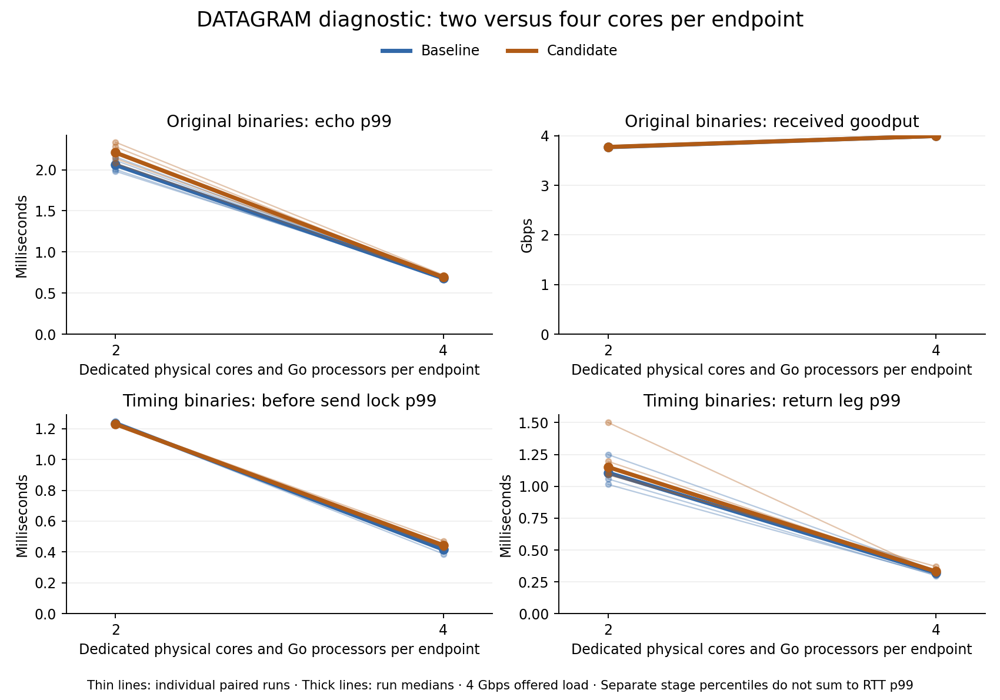

# DATAGRAM diagnostic: two versus four cores per endpoint

Giving each endpoint four dedicated physical cores and Go processors substantially improved this benchmark in both parser variants. Original-binary p99 fell about 67–68%, and goodput rose about 6% to nearly the offered 4 Gbps. Combined CPU time per delivered record increased about 19%. The candidate's approximately 47% receiver-allocation saving persists; its separate tail-latency question remains unresolved. PR 16 remains a draft with unchanged production code.

## Fixed comparison

The [previous probe diagnostic](2026-09-06-datagram-probe-timing.md) identified send-admission and return-path delay at two processors per endpoint. This follow-up froze 32 captures: four rounds of baseline/candidate × original/timing × two/four cores. Budget pairs were adjacent, budget order reversed on alternate rounds, and group order rotated/reversed. All 32 completed and qualified, without failures, exclusions, replacement runs or adaptive extension.

The four existing optimized native Linux Go 1.27.1 executables were reused without rebuilding. Baseline public parser source remains `686bce6541438101c96732a023984e031faf6df7`; candidate runtime remains `391b3df6932fec5f14fc0396947a0c2e4fd8e2a6`. No new instrumentation or tracing was added. Every capture retained native QUIC loopback, 4 Gbps offered traffic, 1071-byte bulk records, 100 sparse 64-byte echo probes/s, 2 seconds warmup, 60 seconds measurement and 1 second drain. The same physical-core pool and unused SMT siblings were reserved in both conditions. Physical-core availability and GOMAXPROCS changed together; this experiment measures their combined effect. Capture date was 2026-09-07 UTC / 2026-09-06 EDT.

## Results

| Original binary | Median run p50, two → four cores | Median run p99, two → four cores | Paired p99 change [descriptive 95% interval] | Goodput, two → four cores |
| --- | ---: | ---: | ---: | ---: |
| Baseline | 0.884 → 0.126 ms | 2.058 → 0.680 ms | −66.90% [−68.41%, −65.32%] | 3.769 → 3.995 Gbps |
| Candidate | 0.966 → 0.123 ms | 2.209 → 0.693 ms | −68.40% [−69.53%, −67.24%] | 3.774 → 3.995 Gbps |

Every original-binary pair improved, with p99 changes ranging −64.60% to −69.86%. Timing-enabled binaries independently showed reductions of about 69–70%. The large core-budget effect therefore appears in both binary classes, although instrumentation remains relevant to smaller candidate-versus-baseline differences.

Combined CPU time per delivered record increased 19.44% baseline and 19.02% candidate. Median combined endpoint CPU usage rose from approximately 2.5 to 3.2 core equivalents. Four cores were available to each endpoint; this does not mean each continuously consumed four cores. Averages below the processor limit do not rule out delays during bursts or handoffs, and these CPU-time results do not measure power consumption.

At the fixed offered rate, higher goodput represents better delivery toward 4 Gbps, not a maximum-capacity or file-throughput result. Median bulk generation misses fell from about 5.6% to about 0.1%. Original baseline/candidate missing echo replies fell from 21/21 to 6/3, while attempts rose from 22531/22411 to 23975/23973. Successful-response tails remain conditional on receipt.

The [complete tables](datagram-core-budget/results-table.md) and [paired aggregate results](datagram-core-budget/paired-results.json) retain all pairs, run medians, resource measurements and loss/generation counters. Ratios are geometric means of within-round comparisons; descriptive intervals use 20000 whole-pair bootstrap resamples with seed 20260907. Four paired runs are the experimental units. Absolute run medians and geometric paired changes are different summaries.

## What remains in the tail

Timing-only request-prelock p99 fell from about 1.23 ms to 0.42–0.44 ms; return-leg p99 fell from 1.11–1.15 ms to 0.32–0.33 ms. For each run's slowest 1% selected by original successful RTT, median prelock share grew from about 42–44% to 81–83%, while return share fell from about 53–55% to 7–8%. The admission span became shorter but now accounts for most of the remaining slow-probe time.

These shares describe the same selected probes within each run. Do not add separate stage p99s or overlapping admission spans to reconstruct RTT p99. Prelock includes setup and time before acquisition, not solely blocked mutex time. No new execution traces were collected, so the data do not separate changes in runnable time, mutex behavior and transport scheduling. They support a consequential execution-budget effect and identify admission as the remaining measurement boundary; they do not prove a packet-level transport cause or that additional cores eliminate serialization.

## Candidate disposition and evidence

At four cores, the original candidate's secondary p99 estimate was +2.08% [−1.38%, +5.09%] relative to baseline. The timing-binary estimate was +5.72% [−1.39%, +13.34%]. At two cores, the original candidate was higher in all four pairs, with a small-sample estimate of +6.94% [5.33%, 9.28%]. These separate descriptive comparisons preserve the candidate-specific concern. Receiver allocation per delivery still fell 47.13% at two cores and 47.09% at four; receiver CPU per delivery fell 1.34% and 2.17%, respectively.

The earlier 20-pair 4 Gbps acceptance result remains +4.04% [−0.20%, +8.45%] against the unchanged 5% bound. The new results are not pooled into that campaign or treated as a replacement gate. The four-core upper endpoint of +5.09% also exceeds +5%. No further traffic, production fix or merge followed. Independent review, full adoption certification and completed D1/D2/program tracking remain outstanding or unchanged.

Validation reconciled independent delivery ledgers and original echo histograms, checked probe counts/identities/ordering without overflow, and verified binary identities and pre-warmup/repeated placement. No bulk records were rejected, canceled, deadline-failed, duplicate, invalid or received without admission. Reserved cores recorded zero guest/steal time; unused SMT siblings averaged 99.970% idle. Background work occurred on other cores and remains documented. In the fourth-round original pairs, outside cores were essentially idle and p99 still fell 68.93%/69.86%. Shared cache, memory and power effects remain limitations. All cores were released and the temporary partition removed.

Raw evidence and executables are preserved privately on two hosts. Archive SHA-256 is `51f1b35ed7eff34876253352d48bef0f5fd7226e4e168ac924dbf589ae0a47cb`. Only generic aggregate findings are public; the private fixture is not reproducible from this repository alone. This diagnostic does not qualify physical-link, disk, FEC or file-completion behavior.
